This repository is just me following along [this great parallel optimization case study](https://ppc.cs.aalto.fi/ch2/) as well as [its chapter about CUDA](https://ppc.cs.aalto.fi/ch4/). A huge THANK YOU to its author [Jukka Suomela](https://jukkasuomela.fi/).

The graphs below result from running the different versions of the code, unaltered from the case study, on a 14-cores i9-10940X CPU and a GeForce GTX TITAN X GPU.

CPU versions of the code were compiled using `g++` 9.43.0 on Ubuntu 20.04.
The "Single-thread" version was compiled without OpenMP support.
The "*N* threads" versions were compiled with `-fopenmp` and run with `OMP_NUM_THREADS=`*N*. See the `Makefile` for more details.

GPU versions of the code were compiled using `nvcc` 11.2 on Ubuntu 20.04.

CPU specs:
- 14 cores, 28 threads
- L1 cache: 896 KiB
- L2 cache: 14 MiB
- L3 cache: 19 MiB
- frequency: 1.2 GHz to 4.6 GHz; around 4.1 GHz to 4.3 GHz when running the benchmarks

Memory specs:
- 4 banks of 16 GiB
- DIMM DDR4 Synchronous 2133 MHz (0.5 ns)

GPU specs:
- model: GeForce GTX TITAN X
- RAM: 12GiB

You can use `./run.sh` to regenerate this report on your machine.
You may want to adapt the parallelism levels to your CPU, in the `Makefile` and in this `README.md`.

# CPU version 0: baseline

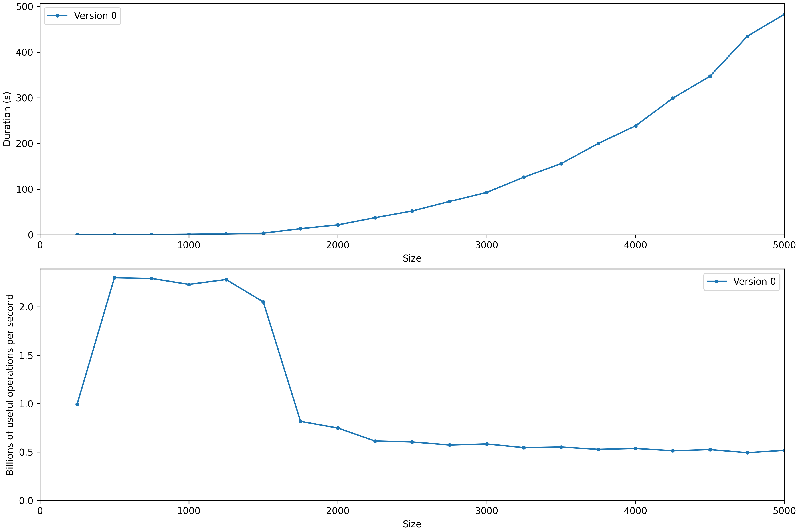

Despite running at a comparable frequency, my CPU doesn't quite reach the 1.3 billion operations per second achieved by the author on Linux with version 0 for n=4000.
The performance I get is close to the one they get on macOS. They say the difference they observe between the two OSes is due to macOS not using Transparent Hugepage Support, so I have to check the page size used on my system (@todo).

The performance of version 0 decreases between n=1500 and n=1750, similarly to what the author observed with a same-sized L3 cache, ...

# CPU version 1: linear reading

... and linear reading (in version 1) fixes that first bottleneck:

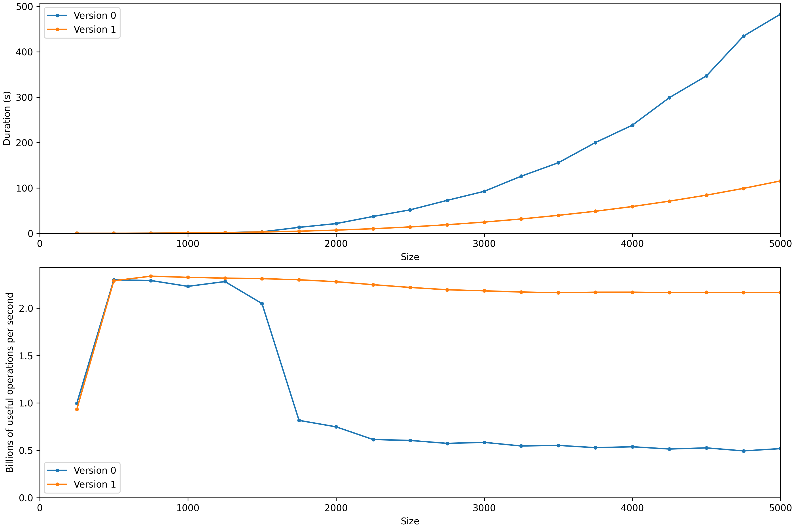
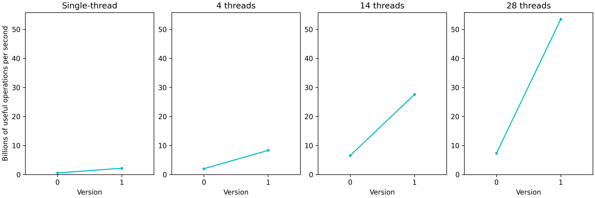

# CPU version 2: instruction-level parallelism

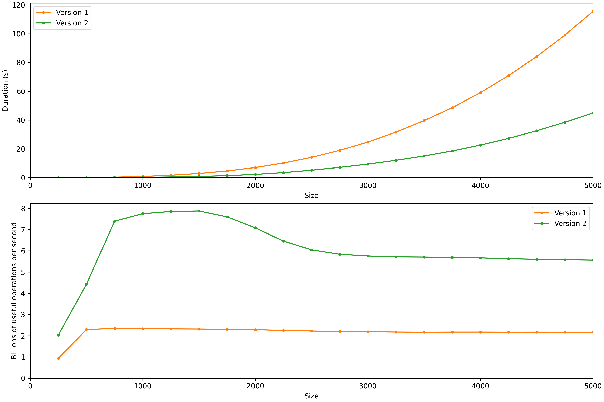

# CPU version 3: vector instructions

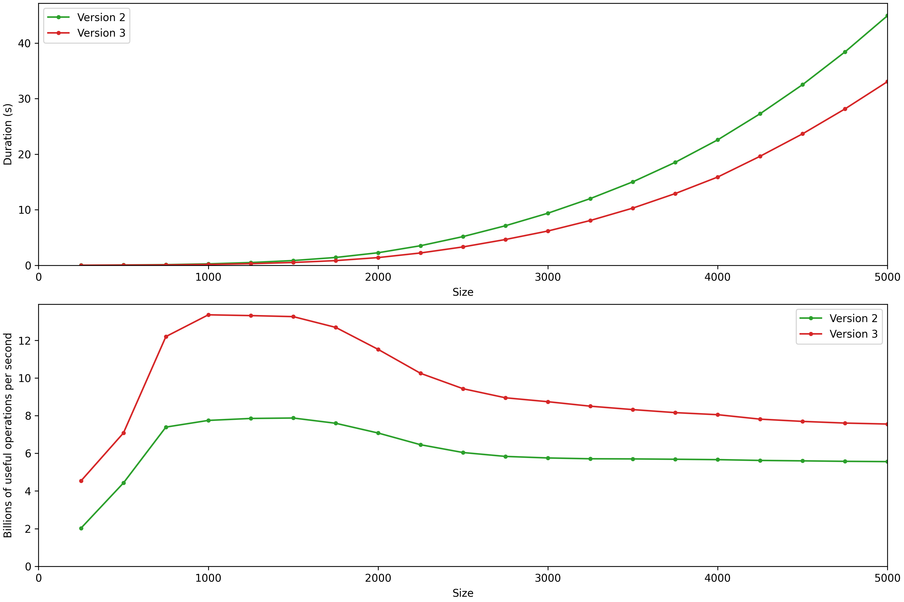
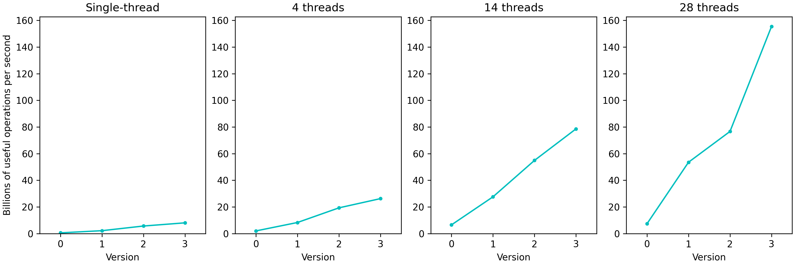

# CPU version 4: reuse data in registers

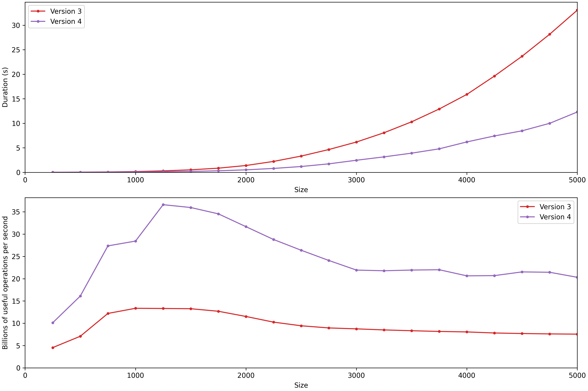
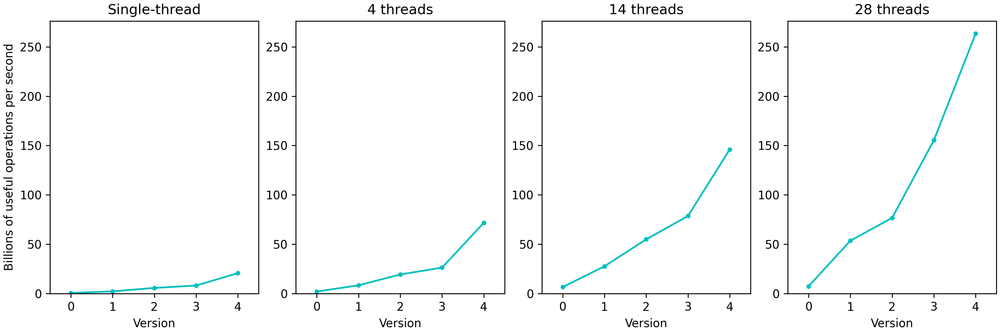

# CPU version 5: more register reuse

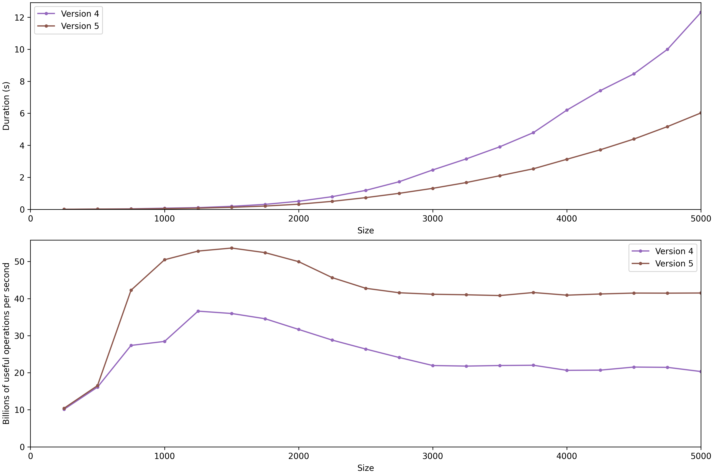
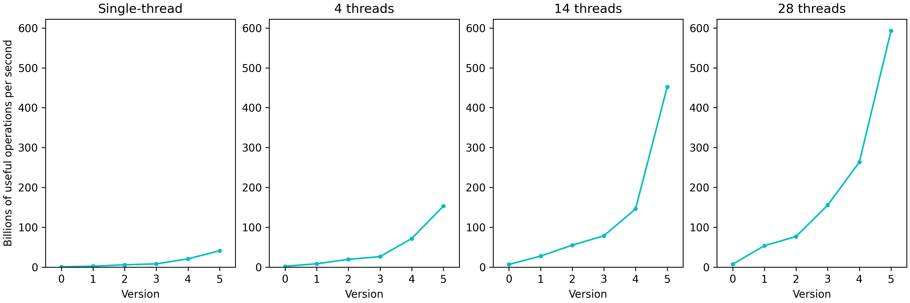

# GPU version 0: baseline

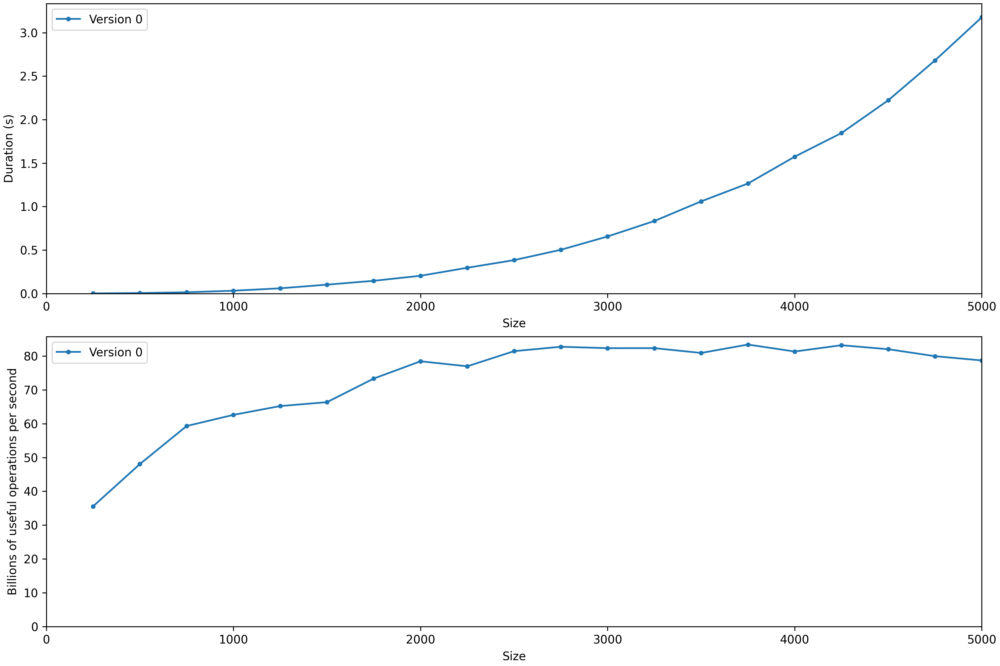

# GPU version 1: better memory access pattern

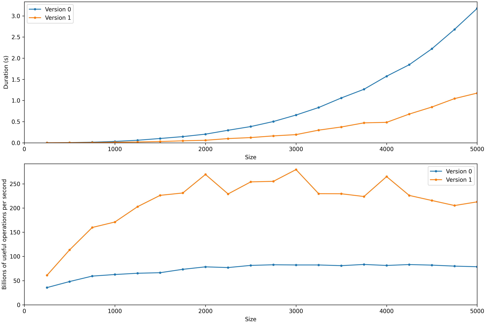
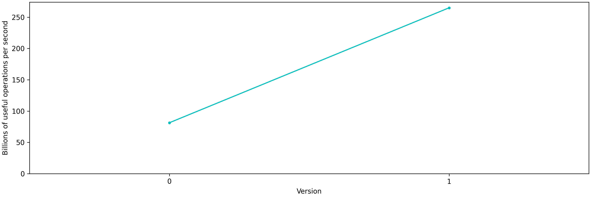

# GPU version 2: reuse data in registers

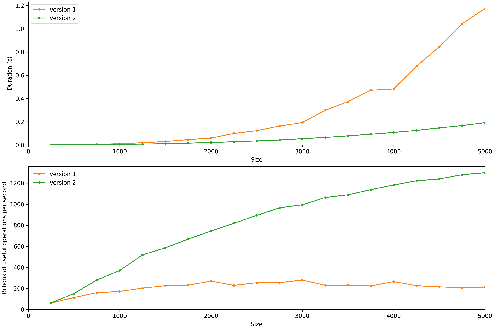
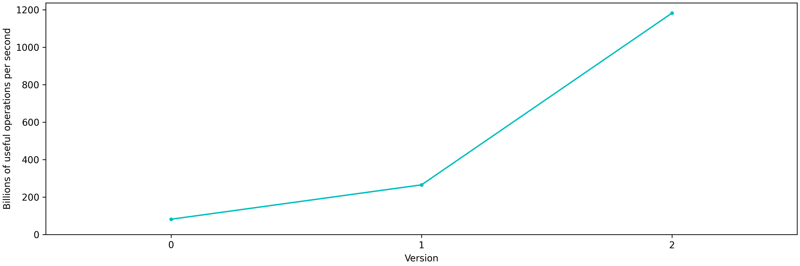

# GPU version 3: reuse data in shared memory

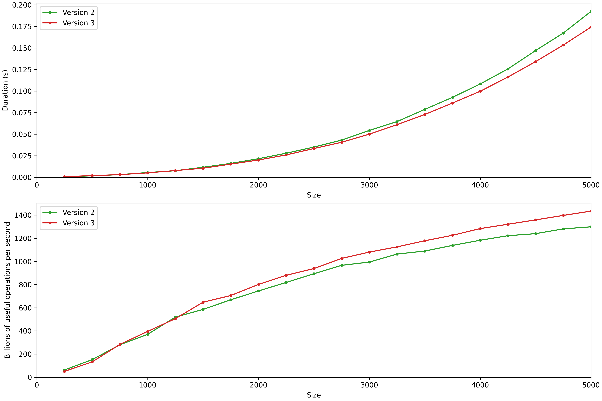
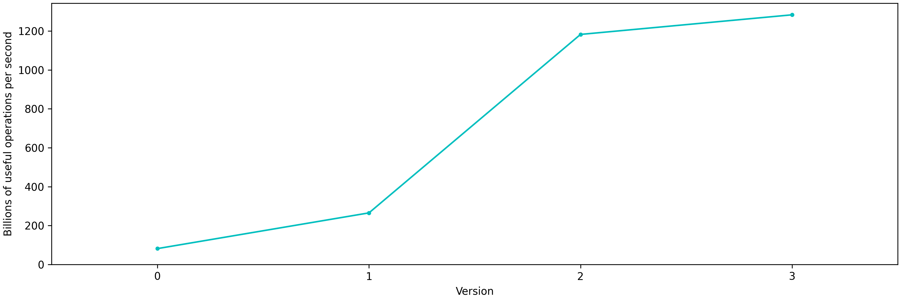
