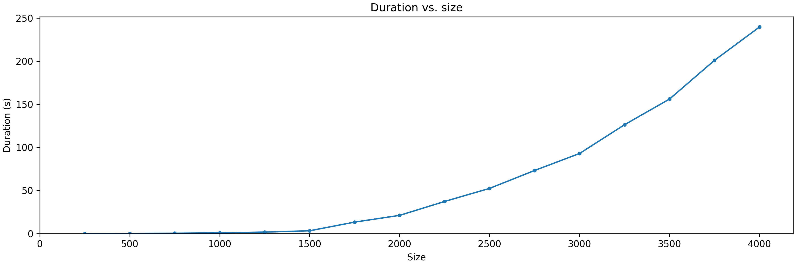

<!-- WARNING, this file is generated by report.py. MANUAL CHANGES WILL BE LOST -->

Just following allong [this great parallel optimization case study](https://ppc.cs.aalto.fi/ch2/).

# V0

|   Size | Duration       |
|--------|----------------|
|    250 | 0.033178322s   |
|    500 | 0.111096002s   |
|    750 | 0.365785246s   |
|   1000 | 0.892332193s   |
|   1250 | 1.702352448s   |
|   1500 | 3.243174963s   |
|   1750 | 13.301683437s  |
|   2000 | 21.102506117s  |
|   2250 | 37.25506203s   |
|   2500 | 52.427934097s  |
|   2750 | 73.158697955s  |
|   3000 | 92.91495181s   |
|   3250 | 126.276617938s |
|   3500 | 156.049761549s |
|   3750 | 200.989649007s |
|   4000 | 239.620419922s |

